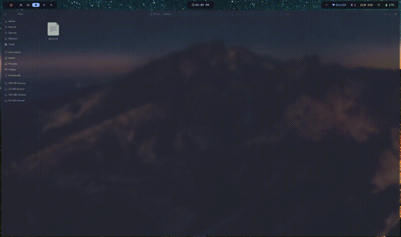

# glance

A file clipboard for Wayland — watches directories for new files and shows a transient widget in [Waybar](https://github.com/Alexays/Waybar).
Click to open a dropdown menu with actions: drag-and-drop, open, edit, or copy the path.

## What's new in 0.3.0

- **Filename in menu** — the dropdown now shows the filename alongside the thumbnail and file size
- **Editor supports arguments** — set `editor = "gimp -n"` or any command with flags in your config
- **Scroll direction fixed** — scroll up goes to newer files, scroll down to older
- **Copy respects scroll selection** — right-click copy now works on whichever file you've scrolled to
- **Proper cleanup** — menu no longer leaves orphaned lock/pid files after dismissal
- **File locking on state** — concurrent access to history state is now safe under flock
- **Fix: waybar polling interval** — changed from `"interval": 1` (spawned 3600 processes/hr) to `"interval": "once"`, relying on signal-based updates instead
- **Fix: shared lock for reads** — `read_history()` now uses a shared lock (`LOCK_SH`) instead of exclusive, preventing lock contention when waybar polls status



## Dependencies

**Arch Linux:**

```sh
sudo pacman -S gtk4 gtk4-layer-shell wl-clipboard swappy
```

**Fedora:**

```sh
sudo dnf install gtk4-devel gtk4-layer-shell-devel wl-clipboard swappy
```

You also need a [Rust toolchain](https://rustup.rs/) and **Hyprland** (uses `hyprctl` for overlay placement).

[swappy](https://github.com/jtheoof/swappy) is a lightweight Wayland screenshot annotation tool used by the Edit button. If not installed, glance will fall back to opening files with your default app. You can also set a different editor in the config.

## Install

**From crates.io:**

```sh
cargo install wayglance
```

On Fedora, you may need to set `PKG_CONFIG_PATH` first:

```sh
PKG_CONFIG_PATH=/usr/lib64/pkgconfig cargo install wayglance
```

**From source:**

```sh
git clone https://github.com/areofyl/glance
cd glance
cargo build --release
cp target/release/glance ~/.local/bin/
```

Then run the setup wizard:

```sh
glance init
```

This automatically:
- Creates the default config at `~/.config/glance/config.toml`
- Adds the Waybar module to your Waybar config
- Appends CSS styles to your Waybar `style.css`
- Adds `exec-once = glance watch` and `SUPER+V` keybind to your Hyprland config

Restart Waybar and you're done.

<details>
<summary>Manual setup</summary>

### Autostart

Add to your Hyprland config (`~/.config/hypr/hyprland.conf`):

```
exec-once = glance watch
bind = SUPER, V, exec, glance drag
```

### Waybar module

Add to your Waybar config (`~/.config/waybar/config.jsonc`):

```jsonc
"custom/glance": {
    "exec": "glance status",
    "return-type": "json",
    "interval": "once",
    "signal": 8,
    "on-click": "glance menu",
    "on-click-right": "glance copy",
    "on-scroll-up": "glance scroll up",
    "on-scroll-down": "glance scroll down"
}
```

Then add `"custom/glance"` to your bar layout (e.g. `modules-right`).
A complete snippet is in [`waybar-module.jsonc`](waybar-module.jsonc).

### Waybar styling

Add to your Waybar CSS (`~/.config/waybar/style.css`):

```css
#custom-glance {
    padding: 0 8px;
    color: #cdd6f4;
}

#custom-glance.active {
    color: #a6e3a1;
}

#custom-glance.empty {
    padding: 0;
}
```

</details>

## Config

Optional. Copy `config.example.toml` to `~/.config/glance/config.toml`
and edit to taste. Everything has sane defaults.

```toml
# directories to watch for new files
watch_dirs = ["~/Pictures/Screenshots", "~/Downloads"]

# RTMIN+N signal to poke waybar
signal_number = 8

# auto-dismiss the waybar widget after N seconds
dismiss_seconds = 10

# skip partial downloads etc.
ignore_suffixes = [".part", ".crdownload", ".tmp"]

# waybar bar height in px (for menu placement)
bar_height = 57

# number of files to remember in history
history_size = 5

# editor command for the Edit button (default: "swappy -f")
# supports full commands with arguments, e.g. "gimp -n" or "swappy -f"
editor = "swappy -f"

# which buttons to show in the dropdown
actions = ["drag", "open", "edit", "copy"]

# auto-dismiss the dropdown after N seconds (0 = never)
menu_dismiss_seconds = 8

# customize menu appearance
[menu_style]
background = "rgba(30,30,46,0.95)"
text_color = "#cdd6f4"
secondary_color = "#a6adc8"
button_background = "rgba(255,255,255,0.08)"
button_hover = "rgba(255,255,255,0.15)"
border_radius = 12
```

## Commands

```
glance init            # set up config, waybar module, CSS, and autostart
glance watch           # run the inotify watcher (long-running)
glance status          # JSON for waybar (called by exec)
glance menu            # dropdown menu below waybar with actions
glance copy            # wl-copy the selected file path
glance drag            # drag-and-drop overlay at cursor
glance scroll up|down  # navigate through file history
```

## License

[MIT](LICENSE)
